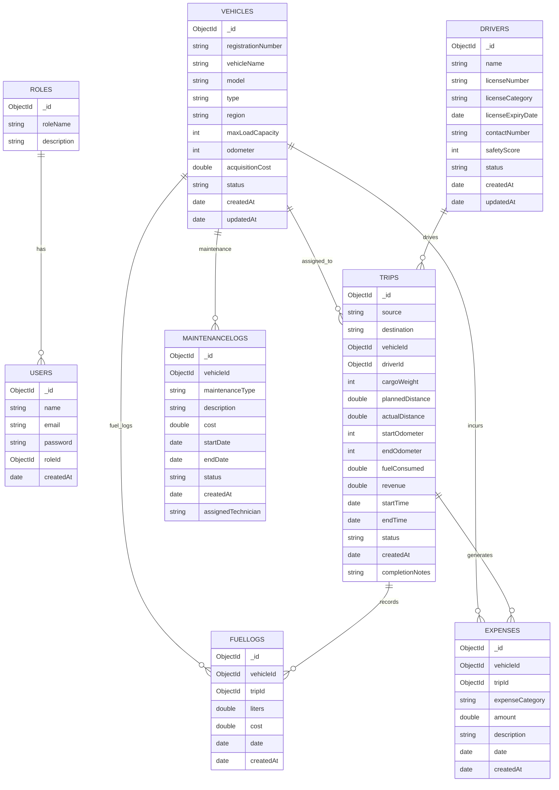

# Technical  architecture Document
## TransitOps Database Design

## Overview

TransitOps uses MongoDB as the primary database for managing transport operations. Collections are connected using ObjectId references to maintain data consistency while keeping the schema scalable and easy to maintain.

---

# Database Collections

## 1. Roles

Stores application roles.

Fields

- roleName (Unique)
- description

---

## 2. Users

Stores authenticated users.

Fields

- name
- email (Unique)
- password
- roleId (Reference → Roles)

---

## 3. Vehicles

Stores vehicle details.

Fields

- registrationNumber (Unique)
- vehicleName
- model
- type
- region
- maxLoadCapacity
- odometer
- acquisitionCost
- status

Vehicle Status

- Available
- On Trip
- In Shop
- Retired

---

## 4. Drivers

Stores driver information.

Fields

- name
- licenseNumber (Unique)
- licenseCategory
- licenseExpiryDate
- contactNumber
- safetyScore
- status

Driver Status

- Available
- On Trip
- Off Duty
- Suspended

---

## 5. Trips

Stores trip information.

Fields

- source
- destination
- vehicleId
- driverId
- cargoWeight
- plannedDistance
- actualDistance
- startOdometer
- endOdometer
- fuelConsumed
- revenue
- startTime
- endTime
- status
- completionNotes

Trip Status

- Draft
- Dispatched
- Completed
- Cancelled

---

## 6. MaintenanceLogs

Stores maintenance records.

Fields

- vehicleId
- maintenanceType
- description
- cost
- startDate
- endDate
- status
- assignedTechnician

Status

- Active
- Completed

---

## 7. FuelLogs

Stores fuel transactions.

Fields

- vehicleId
- tripId
- liters
- cost
- date

---

## 8. Expenses

Stores operational expenses.

Fields

- vehicleId
- tripId
- expenseCategory
- amount
- description
- date

Expense Categories

- Fuel
- Maintenance
- Repair
- Toll
- Insurance
- Parking
- Other

---

# Collection Relationships

Roles (1)
│
└── Users (Many)

Vehicles (1)
├── Trips (Many)
├── MaintenanceLogs (Many)
├── FuelLogs (Many)
└── Expenses (Many)

Drivers (1)
└── Trips (Many)

Trips (1)
├── FuelLogs (Many)
└── Expenses (Many)
---

# Database Schema (ER Diagram)

The following Entity Relationship Diagram illustrates the database schema and relationships between all TransitOps collections.

---

# Unique Indexes

| Collection | Field |
|------------|-------|
| Roles | roleName |
| Users | email |
| Vehicles | registrationNumber |
| Drivers | licenseNumber |

---

# Business Rule Validation

The backend enforces the following validations:

- Vehicle registration number must be unique.
- Driver license number must be unique.
- Cargo weight cannot exceed vehicle maximum load capacity.
- Retired vehicles cannot be dispatched.
- Vehicles under maintenance cannot be dispatched.
- Drivers with expired licenses cannot be assigned.
- Suspended drivers cannot be assigned.
- Vehicles already on a trip cannot be assigned again.
- Drivers already on a trip cannot be assigned again.
- Dispatch automatically updates Vehicle and Driver status to **On Trip**.
- Completing a trip restores Vehicle and Driver status to **Available**.
- Cancelling a dispatched trip restores Vehicle and Driver status.
- Creating maintenance changes Vehicle status to **In Shop**.
- Closing maintenance restores Vehicle status unless retired.

---

# Analytics Supported

The database supports the following analytics:

- Fleet Utilization
- Fuel Efficiency
- Operational Cost
- Vehicle ROI
- Dashboard KPIs

---

# Design Principles

- Reference-based schema using ObjectIds
- Minimal data duplication
- Normalized collection relationships
- Optimized for CRUD operations
- Supports reporting through MongoDB aggregation pipelines
- Designed for scalability and maintainability